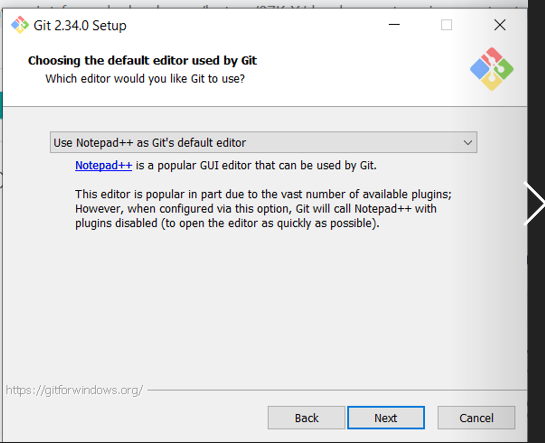

# Environment setup, things to install

- [ ] chrome browser (for developer tools)
- [ ] github account
- [ ] code editor (VS Code or SublimeText3)
- [ ] install git for windows 
  - [ ] enable windows command prompt, and windows default console window
  - [ ] to check, in the command prompt type `git --version`
- [ ] install node.js for windows (we need this to install browsersync)
  - [ ] to check, from command prompt type `node--version`
  - [ ] it'll also install the node package manager (nmp), to check at cmd prompt type `npm --version`
- [ ] install browsersync, if you google it'll tell you the command to use, which is *npm install -g browser-sync*
  - [ ] as usual, to check in CMD type `browser-sync --version`

# Install git on windows

## download location 


run the installer


## installer options

on the Lenovo, I changed the install location to D:


kept default components to install


picked notepad++ as default editor because I do not have VS Code installed (and anyhow I think this is only commit messages)



set the default branch name to "main" (rather than "master")


set git to run from the command line 


other settings for SSH


line ending conventions


windows default console rather than MinTTy


default git pull behavior


new credential helper


other options left as default


## check that git installed

after this it installs. When finished you in CMD you can do `git --version` to check

Then, for example you can use `git clone [github url]` to clone a remote repository to this local machine.

## set up identity

when you try to do your first commit it will complain because you've yet to set up your identity: 


to do this:

```
git config --global user.email "nardella.anna@gmail.com"
git config --global user.name "Anna Nardella"
```

nb the `--global` option sets this identity for all repositories

after doing this, `git config --list` will show you that the identity is set:


at which point the commit works (it fires up notepad++ for entering the commit message, after which you must save and close the editor)

## store github credentials

the first time you do **git push**, you will see a connect to github dialog:


If you choose sign in with your browser, you go to the credential manager page:


There you enter your github credentials:


at which point it completes the git push:


at which point, for future commits, you do not need to enter your github credentials any more

# git how tos (command line)

## clone remote repository to local machine

- [ ] create a respository for the course (coursera-test) 
  
- [ ] clone the repository to your local machine: 
  - [ ] In the **Code** menu you can find the URL of the repository on github:
    
  - [ ] In the CMD prompt issue the command git clone followed by the url. eg
    *git clone https://github.com/acnard/coursera-test.git*
- [ ] Now the repository is cloned inside the folder from which you issued the clone command (in this case Users\Anna Nardella). If you cd into the repository folder (coursera-test) you can issue a git status command: 
  
- [ ] at this point, when you work on this local clone of the repository you can mark changes for commit, then commit them, then push your commits to the remote repository. The commands are:
  - [ ] git add
  - [ ] git commit -m
  - [ ] git push
  - [ ] git pull 
- [ ] the first time you try to commit you will be prompted to set up your name and email address in gitconfig

## move the local clone of a remote git repository

I'd initially cloned the remote repository to Users\Anna Nardella,  

but now I'd like this to be under C:\ACNdata\WebDev . I can accomplish this by just moving the entire coursera-test folder to the desired location. Alternatively, I could delete it and re-clone the repository by CDing into it from the command prompt and then issuing the git clone command.

I tried just moving the entire coursera-test folder (which has the .git folder inside it) to the desired location. Then, to check I went into it and did git status and it worked. 

## Track new files (git add)

Now, what I want to do is have also my course notes and test files in the repository, so that I can work on this course from different PCs.

so what I'll do is move the *course_notes* folder under coursera-test and see what happens:


it recognizes that I've added this folder and tells me it is not tracked. So now I have to do `git add course_notes`: it should recursively add everything contained in that directory. 


and now it stages all the new files in the folder. NB the files are staged exactly as they were when you did `git add`. And then when you commit it is the staged version that gets used. So if you do any subsequent changes you need to restage.

## commit the changes

Now I can do `git commit` to commit the newly staged files: I need to enter a message in my preconfigured editor (which is VS code)


at which point the changes are commited: 


## push commits to remote repository

At this point if I do a git status I will see that some changes are not staged (because I am editing inside course_notes, so there are new changes there), but I can push the changes that *have* been staged by doing `git push`.


And after this I expect to see the new files in the remote repository on github:


and in fact there it is: 


## git config to set name and email address

when you run the git config command you can set various global settings, in windows the gitconfig file is located in the windows user folder: 


In CMD prompt you can just type git config to see the list of commands, or git config --list to see the currently stored settings:


The name and email I'd previously set globally (you could also do it repository-specific) with the commands: 


## stage all changes (untracked files, changed files, and deleted files) 

after adding some new folders to the coursera-test folder, I did git add on those folder names to start tracking all the files in them. Then, when I did git status I got this: 


it had staged the files inside the newly added folders, but there had also been some changes elsewhere, which were not staged.

To stage all the changes you have made (including deletions!) you can use the command `git add -A`:


now everything is staged  and I can do **git commit** followed by a **git push**.


 


# github pages

from the github repository click **Settings**, select the **Pages** tab, and you can see the URL where the repository web pages are published
 

Now, clicking directly on this will just give you an autogenerated page, but you can edit this URL to view any other html page inside your repository. For example, my module2 solution is here: 


And if I edit the pages URL appropriately I can view the html file : 


# Browsersync

- To install this you need to first install node.js for windows (which installs node package manager, npm)

- Once that is done you can use the command  `npm install -g browser-sync`

- When browser-sync is installed, from the command line you should be able to check its version: 


## start browsersync on a folder

To start browsersync, you first navigate to the folder in which you want to sync changes to files (the browser will auto reload whenever there is a change to a file in that folder), then give a command like this:


where `--directory` just gives you a listing of the folder you are in, and `--files "*"` says to sync changes in all files in the folder. 

So in my case the command is: 


and now at the access URL it shows me the folder being synced:


however this doesn't actually work because the command does NOT include subfolders, so it'll only watch the files in the folder where you started browser sync. 

Instead, what you need to do is: 

```
browser-sync start --server --files="**/*"
```


this makes it watch the files in the current folder plus those in any subfolders (in my case, the css folder)


# chrome developer tools

## layout config

to get the desired layout:

1. In the chrome developer tools window, click the three-dot menu and choose the bottom-docking option 
   
2. Then click the gearwheel to open chrome dev tools settings
   
   and select the vertical panel layout:
   

This will give you the actual webpage on top, and underneath it the html and styles side-by side, and the console under that.:


# Bootstrap

From **getbootstrap.com** you can download compiled CSS and JS:


The zip you download from there contains a css folder and a js folder with all the bootstrap files:

 

nb in the lecture it says you also have to install jquery, which bootstrap depends on, however bootstrap 5 non longer depends on jquery.

## lecture 25 example

In the lecture25 example, styles.css is initially an empty file where we define our own css styles (overriding/customizing the bootstrap ones), and for this reason we must declare it *after* bootstrap.min.css.

nb bootstrap.min.css is just bootstrap.css with all unnecessary whitespace taken out, for faster performance.

Similarly script.js is an initally empty file into which we can put in our own add-on javascript, and we likewise declare this after the bootstrap js files.


## my own example with bootstrap 5

to re-create the above with bootstrap 5, I did *not* download jquery. I just copied the bootstrap css and js folders into my working directory and created an index html file similar to the above, only I removed the reference to jquery


This initially gave me errors in the console because I hadn't put the empty script.js and styles.css files into the folders yet. But once I added the files the errors went away

## grid system

you always have to have an outermost container, which can contain rows that in their turn contain columns:


the column classes are interpreted like so.

-  **Size** specifies a screen size (eg, md = medium) from which those columns apply (for smaller screen sizes the columns will collapse and just stack one on top of the other, *unless* there is another rule that applies.)
- **Span** is just how many columns (of the total 12) the element should span


Bootstrap is a 12- column grid. If on a row you specify elements whose spans add up to more than 12, they will wrap onto another row. For example, if I have four columns of span 4:


nb you don't have to use divs to use the bootstrap classes, you can also apply them to other html elements: 


## container vs container-fluid

- container toggles between different fixed-width layouts at the various screen size breakpoints. 

- container-fluid also toggles, but in addition to this stretches/contracts to fit in between breakpoints.

## breakpoints

the bootstrap documentations shows to what the md, lg, sm, and other size breakpoints correspond.


nb cf how these have changed relative to the older version of bootstrap (below): 
in practice, *the old sm is now md, the old md is now lg, and the old lg is now xl*


so in my case (md) as I shrink the screen down the columns continue to be side-by-side, down to a width of 768. But the moment I go to 767pixels, the columns stack  (the below is with the fluid-container, so the columns also stretch to fill whatever horizontal space is available in either case)


with the regular (non-fluid) container, the result is instead as below : 


## multiple classes (breakpoints) per column 

 I can do something like this, 


and now, when I go below 678 pixels, instead of just stacking it will apply the span I've specified for **sm** screen size, ie that each column in that case should have a span of 6. This means each column will take up half the screen (since there are 12 columns total in the bootstrap grid). So the third column will overflow.


two rows with overflow look like this (added margin to have some space between rows):


This sm column span applies down to 576 pixels:


But as soon as we go below that it stacks: 


## specify xsmall column span

to specify what column span you want *below* the **sm** one, just use no infix at all, and that will apply down to zero pixels.: For example, here in the second row, the col-8 says that below the sm breakpoint we want the span to be 8 columns. If you *just* specified this (removing the md and sm spans) then the 8-column span would apply no matter what.

 

  
