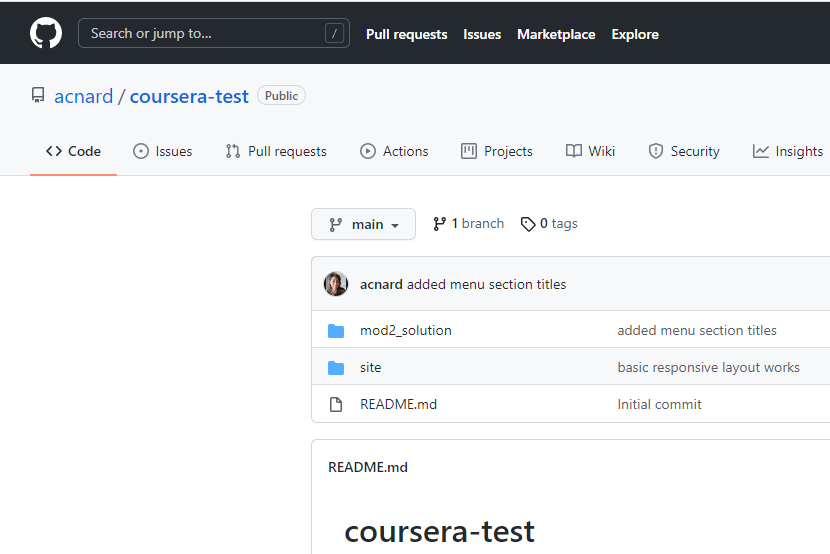

# Environment setup, things to install

- [ ] chrome browser (for developer tools)
- [ ] github account
- [ ] code editor (VS Code or SublimeText3)
- [ ] install git for windows 
  - [ ] enable windows command prompt, and windows default console window
  - [ ] to check, in the command prompt type *git --version*
- [ ] install node.js for windows (we need this to install browsersync)
  - [ ] to check, from command prompt type *node--version*
  - [ ] it'll also install the node package manager (nmp), to check at cmd prompt type *npm --version*
- [ ] install browsersync, if you google it'll tell you the command to use, which is *npm install -g browser-sync*
  - [ ] as usual, to check in CMD type *browser-sync --version*

# git how tos (command line)

## clone remote repository to local machine

- [ ] create a respository for the course (coursera-test) 
  
- [ ] clone the repository to your local machine: 
  - [ ] In the **Code** menu you can find the URL of the repository on github:
    
  - [ ] In the CMD prompt issue the command git clone followed by the url. eg
    *git clone https://github.com/acnard/coursera-test.git*
- [ ] Now the repository is cloned inside the folder from which you issued the clone command (in this case Users\Anna Nardella). If you cd into the repository folder (coursera-test) you can issue a git status command: 
  
- [ ] at this point, when you work on this local clone of the repository you can mark changes for commit, then commit them, then push your commits to the remote repository. The commands are:
  - [ ] git add
  - [ ] git commit -m
  - [ ] git push
  - [ ] git pull 
- [ ] the first time you try to commit you will be prompted to set up your name and email address in gitconfig

## move the local clone of a remote git repository

I'd initially cloned the remote repository to Users\Anna Nardella,  

but now I'd like this to be under C:\ACNdata\WebDev . I can accomplish this by just moving the entire coursera-test folder to the desired location. Alternatively, I could delete it and re-clone the repository by CDing into it from the command prompt and then issuing the git clone command.

I tried just moving the entire coursera-test folder (which has the .git folder inside it) to the desired location. Then, to check I went into it and did git status and it worked. 

## Track new files (git add)

Now, what I want to do is have also my course notes and test files in the repository, so that I can work on this course from different PCs.

so what I'll do is move the *course_notes* folder under coursera-test and see what happens:

it recognizes that I've added this folder and tells me it is not tracked. So now I have to do *git add course_notes*: it should recursively add everything contained in that directory. 

and now it stages all the new files in the folder. NB the files are staged exactly as they were when you did git add. And then when you commit it is the staged version that gets used. So if you do any subsequent changes you need to restage.

## commit the changes

Now I can do **git commit** to commit the newly staged files: I need to enter a message in my preconfigured editor (which is VS code)

at which point the changes are commited: 

## push commits to remote repository

At this point if I do a git status I will see that some changes are not staged (because I am editing inside course_notes, so there are new changes there), but I can push the changes that *have* been staged by doing git push.

And after this I expect to see the new files in the remote repository on github:

and in fact there it is: 

## git config to set name and email address

when you run the git config command you can set various global settings, in windows the gitconfig file is located in the windows user folder: 

In CMD prompt you can just type git config to see the list of commands, or git config --list to see the currently stored settings:

The name and email I'd previously set globally (you could also do it repository-specific) with the commands: 

## stage all changes (untracked files, changed files, and deleted files) 

after adding some new folders to the cursera-test folder, I did git add on those folder names to start tracking all the files in them. Then, when I did git status I got this: 

it had staged the files inside the newly added folders, but there had also been some changes elsewhere, which were not staged.

To stage all the changes you have made (including deletions!) you can use the command **git add -A**:

# github pages

from the github repository click **Settings**, select the **Pages** tab, and you can see the URL where the repository web pages are published
 

Now, clicking directly on this will just give you an autogenerated page, but you can edit this URL to view any other html page inside your repository. For example, my module2 solution is here: 

And if I edit the pages URL appropriately I can view the html file : 

